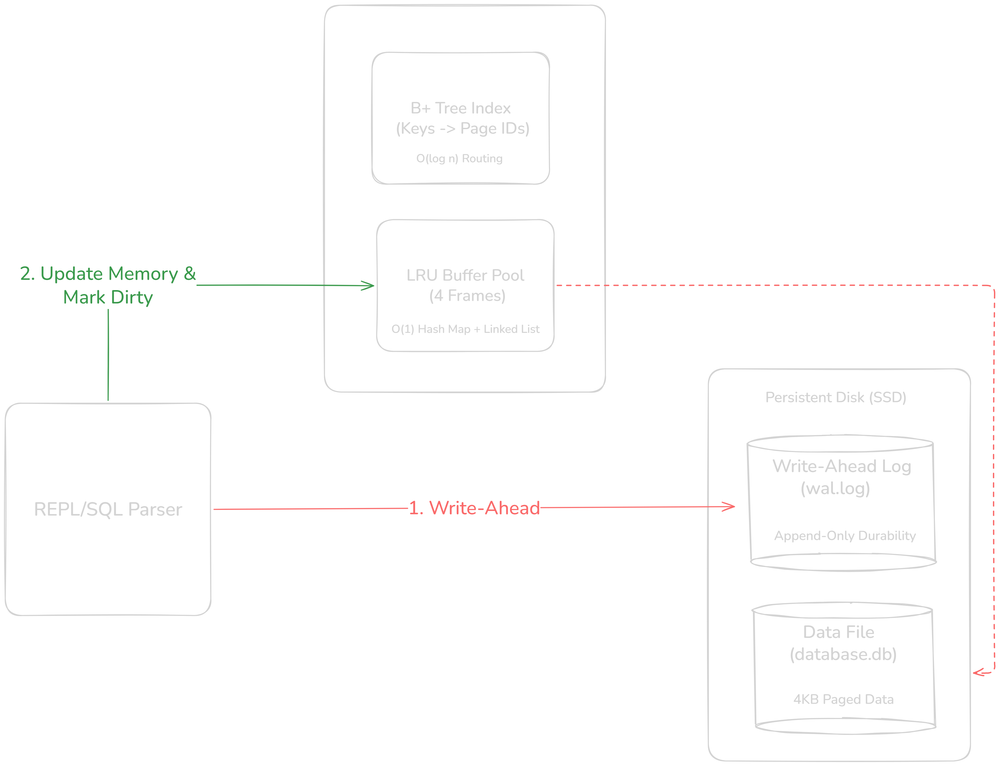
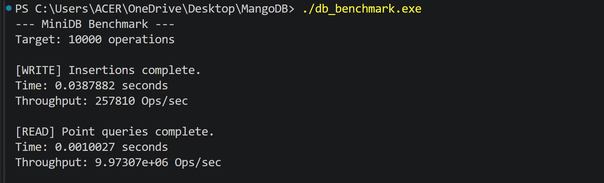
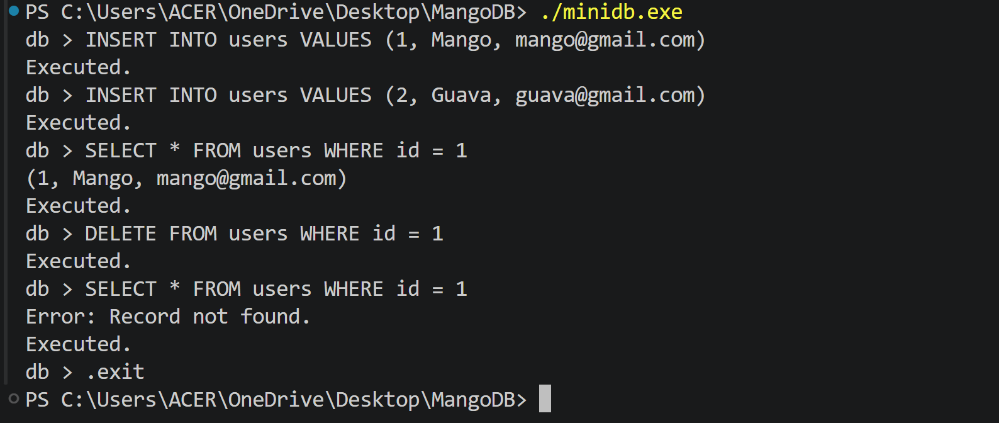
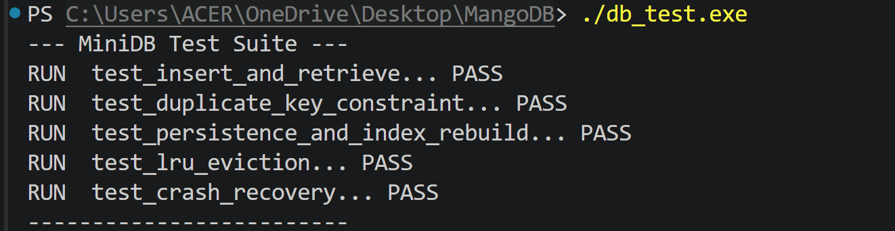

# MiniDB: A Custom Relational Database Engine


MiniDB is a lightweight, disk-backed relational database engine engineered entirely from scratch in C++. Built without external libraries, it is designed to demonstrate core database architecture, memory management, and data durability at the systems level.

MiniDB bypasses standard tutorial architectures by implementing a **Bitcask-inspired storage model**, trading disk-backed indexing complexities for extremely high read throughput and safe crash recovery.



## ⚡ Performance Benchmarks

Benchmarked on 10,000 sequential operations, MiniDB demonstrates significant throughput by separating the in-memory routing layer from the persistent storage layer.




* **Read Throughput:** ~9.9M Ops/sec (Driven by 100% in-memory B+ Tree routing)
* **Write Throughput:** ~257k Ops/sec (Sequential WAL flushing via OS Page Cache)

## 🚀 Core Engine Internals

### 1. The In-Memory B+ Tree Index
Instead of persisting the B+ Tree to disk and risking cascading write-amplification or mid-split corruption, the index is rebuilt entirely in RAM upon database startup via a rapid linear scan. Point queries (`SELECT ... WHERE id = X`) are routed to precise disk offsets in O(log n) time.

### 2. O(1) LRU Buffer Pool Manager
Memory limits are strictly enforced via a custom Least Recently Used (LRU) cache utilizing a doubly-linked list paired with an `std::unordered_map`. 
* Cache lookups and evictions execute in strictly O(1) time.
* Disk I/O is minimized via a `dirty-page` flag, ensuring only modified frames are written back to the SSD during eviction.

### 3. Write-Ahead Log (WAL) & Crash Recovery
MiniDB enforces strict ACID durability. Every modifying transaction (Insert/Delete) is sequentially appended to the WAL before any volatile memory frames are altered.
* **Crash Recovery:** If the process is killed unexpectedly, the engine dynamically replays the WAL on the next boot to reconstruct the exact B+ Tree and memory state.
* **Checkpointing:** Upon a clean `.exit`, dirty pages are flushed and the WAL is automatically truncated to prevent infinite log bloat.

## 🛠️ Getting Started

### Compilation
The engine compiles using standard GCC. No CMake or external build systems are required.

```bash
# Compile the main database REPL
g++ -std=c++17 -O3 main.cpp parser.cpp table.cpp executor.cpp btree.cpp wal.cpp -o minidb
```

### Running the REPL
```bash
./minidb
```


### Running the Custom Test Suite
MiniDB includes a zero-dependency, macro-driven unit testing framework to strictly isolate and validate memory serialization, primary key constraints, and binary file persistence.

```bash
g++ -std=c++17 test.cpp table.cpp executor.cpp btree.cpp wal.cpp -o db_test
./db_test
```
